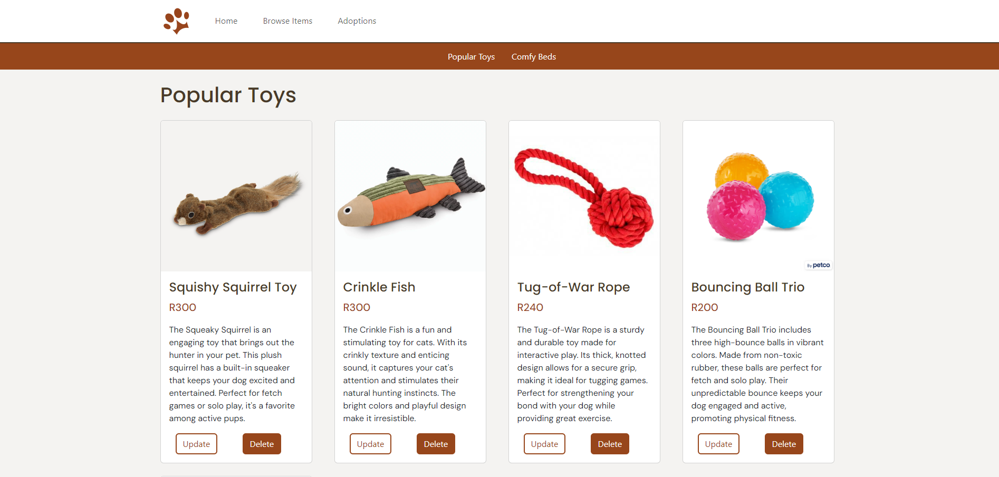

This is my individual Assessment where I was tasked to create a full-stack web application using the MERN stack (MongoDB, Express, React, Node.js) that performs CRUD (Create, Read, Update, Delete) operations. 

[Watch the demo »]
Src
-assets
--demo video

## Table of Contents

* [About the Project](#about-the-project)
   * [Home](#home)
   * [Browse Plants](#browse-plants)
* [Getting Started](#getting-started)
  * [Installing](#installing)
* [Built With](#built-with)
* [Contributing](#contributing)
* [Authors](#authors)
* [License](#license)
* [Acknowledgements](#acknowledgements)

## About The Project

Purrfect Pets is a platform where the admin can update and delete toys and also add a pet to the Adoption list.

### Home


### Browse Items



### Adoption Page


## Getting Started

These instructions will get you a copy of the project up and running on your local machine for development and testing purposes.

### Installing

1. Clone the repo
```sh
git clone https://github.com/paulowi/DV100-T3-Class-Project-Test
```
2. Open the project

Use `Open Workspace` in Visual Studio.

3. Open Terminal

Click terminal and click New Terminal

4. Navigate to the backend

cd backend
npm start

2. Add another terminal

npm start

## Built With

* [Javascript](https://developer.mozilla.org/en-US/docs/Web/JavaScript)
* [jQuery](https://jquery.com/)
* [Bootstrap](https://getbootstrap.com/)
* [MongoDB](https://cloud.mongodb.com/v2/6657606a3c03272fbfe2e304#/metrics/replicaSet/665760a629f2e157a4ed6cc5/explorer/PurrfectPets/toys/find)


## Contributing

## Authors

* **Kayla Posthumus** - *HTML, CSS, Javascript* - [KaylaPosthumus](https://github.com/KaylaPosthumusOW)

## License

This project is licensed under the MIT License - see the [LICENSE.md](LICENSE.md) file for details

## Acknowledgements

* Hat tip to anyone whose code was used
* Inspiration
* Wolf Botha 